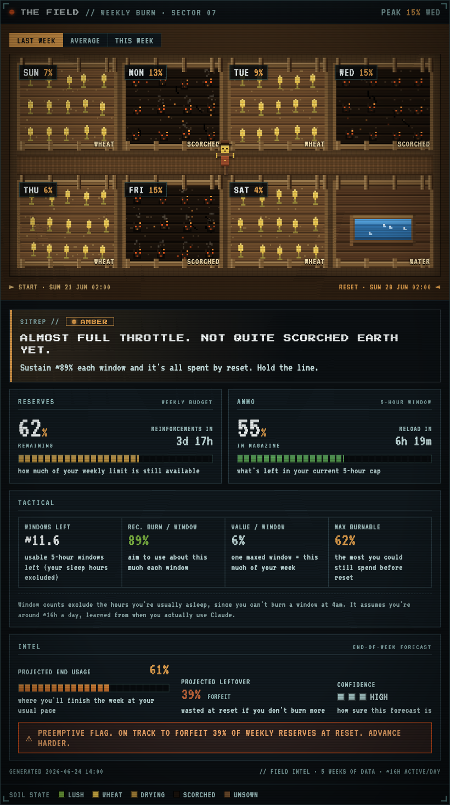
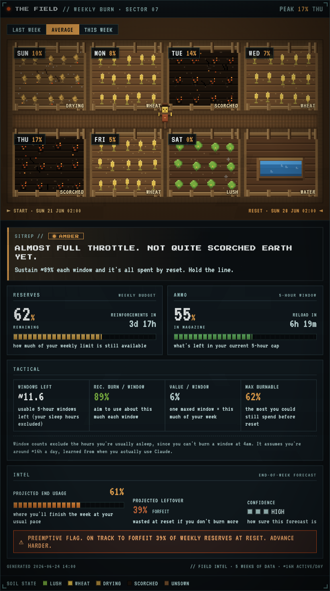
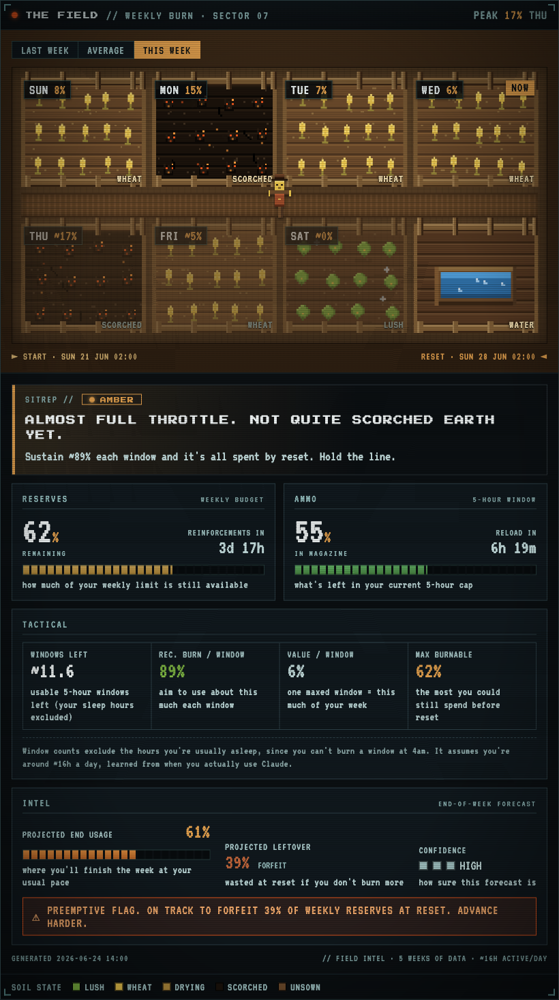
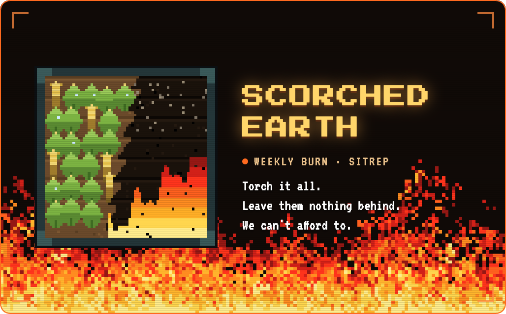

https://github.com/user-attachments/assets/52706f21-19d8-49f1-b5cc-1a5ec865a508

# Scorched Earth

*Claude Code plugin for weekly Claude usage and rate-limit tracking, with a DEFCON-ranked autonomous task runner (Course of Action) for your linked repos.*

A green light for your Claude usage. It tells you when your remaining **weekly**
budget can no longer be spent unless you max out **every remaining 5-hour
window**, so you never leave credits on the table at the weekly reset.

Unused weekly usage doesn't roll over. When you have lots of weekly budget left
but few windows before the reset, the rational move is to go scorched earth: burn
100% every window. It surfaces that moment as **🔥 BURN IT ALL** in your Claude Code
statusline, plus a `scorch` CLI / `/scorched-earth` skill readout.

## The idea

Claude Code exposes two live rate-limit buckets to the statusline: a **5-hour**
rolling window and a **7-day** (weekly) window. Scorched Earth compares:

- how much weekly budget you have left, against
- how many 5-hour windows remain before the weekly reset.

If you couldn't possibly spend your remaining weekly budget even by maxing every
remaining window, the light goes green. Pacing yourself just wastes credits.

## Two signals

The **🟢 hard light** is the certain one. It goes green only when you can't spend your
remaining weekly budget even by maxing every 5-hour window left before the reset. It fires
late, and it's never wrong. In the default fire style that green reads **🔥 BURN IT ALL**.
One notch back is amber, **🟡 burn ~N%**: close to the line, not over it. When you have
ample budget and time the bar shows **⚪ no rush**: deep reserves, pace normally. The bar
is only empty when there's no live reading yet or the weekly budget is exhausted.

The **🔥 forecast nudge** comes earlier, and for most people it's the more useful of the two.
Scorched Earth learns your day-of-week pattern and projects where the week is heading. If
you're tracking to leave budget unused at your usual pace, it fires one desktop nudge per
weekly cycle. It starts rough and sharpens over a few weeks, same as the calibration. Most
people never max every window, so this usually lands well before the hard light would.

See `docs/the-math.md` for the full derivation (both signals) and `docs/playbook.md`
for how it's built.

## Quick start

```bash
scorch            # full readout from the latest live snapshot
scorch --watch    # re-print as data updates
scorch --style fire      # change the statusline light (fire|emoji|text|minimal|off)
scorch --sitrep   # open a stylized HTML field report (8-bit war / scorched crop field)
```

The **sitrep** (`scorch --sitrep`, alias `--report`) renders a war-HUD situation report
with THE FIELD: a Stardew-style pixel farm where each weekday plot grows lush when you
burn light and chars when you burn heavy. Toggle the field between **LAST WEEK** (what you
actually burned), **AVERAGE** (your all-time habit), and **THIS WEEK** (actual so far plus
projected/recommended for the days ahead).

When the verdict goes green, the whole sitrep catches fire. Toggle the field across the
three views:

<p align="center">
  
  
  
</p>

<sub><i>Sample data. The clip and stills are rendered from the real report pipeline (<a href="[assets/52706f21-19d8-49f1-b5cc-1a5ec865a508])">download the mp4</a>).</i></sub>

## Burn it on something

The green light tells you to burn. It doesn't tell you what on. That's the Course of
Action layer.

Link a repo or a few with `scorch link <path>`, and a scan agent reads them the way you
would: TODO and FIXME markers, recent commit themes, the roadmap, whatever open issues it
can reach. It surfaces the expensive work, the jobs big enough to be worth a window you'd
otherwise waste, and rates each one DEFCON 5 down to 1 by impact on the project rather than
effort. DEFCON 1 is the biggest blast radius: a whole-codebase security audit, a full
regression and UI-capability test harness, a backend built out in one pass. The scale
measures stakes, not urgency, so a DEFCON 1 is the most consequential job, not the one you
necessarily start with.

`/coa` generates the ranked plan. From there you can queue jobs and let them run headless in
a sandboxed git worktree (`scorch coa run`), each one committed but never pushed and checked
against a test command you set. The Rules of Engagement (`/roe`) decide what's allowed to run
unattended: DEFCON 1 and 2 sit behind an approval gate by default, and `max_jobs` caps a run
so an overnight campaign can't sprawl.

`/war-room` opens the live version, a localhost cockpit with a kanban board, drag-to-queue,
and a runner that drains your linked repos in parallel, one job each at a time. The URL
carries a one-time access token, so treat it like a credential and don't paste it around.

## Install

**As a plugin (recommended).** This repo is its own marketplace. In Claude Code:

```
# from a local clone (works today, no remote needed):
/plugin marketplace add ~/scorched-earth
/plugin install scorched-earth@scorched-earth

# or, from GitHub:
/plugin marketplace add euan-maley/scorched-earth
/plugin install scorched-earth@scorched-earth
```

Then it's automatic. A SessionStart hook wires the light into your statusline (wrapping
any statusline you already have, never replacing it), and `/scorched-earth`, `/sitrep`,
`/coa`, `/roe`, `/war-room`, and `scorch` are available in-session. The first time you run
`/scorched-earth` it walks you through a quick setup: it picks a light style and links any
repos you want the COA layer watching. You can redo it anytime, or just run
`scorch --style <x>` to change the light on its own.

**Manually (clone):**

```bash
git clone https://github.com/euan-maley/scorched-earth ~/scorched-earth
~/scorched-earth/install.sh   # puts `scorch` on PATH, picks a style, wires the statusline
```

Requires `python3` ≥ 3.8 (no pip deps). The light and CLI are cross-platform; the desktop
notification and `--sitrep` auto-open use macOS (`osascript`/`open`) with a Linux fallback
(`notify-send`/`xdg-open`) and otherwise no-op.

The three layers that make it work: a **statusline script** (the engine, and the only
surface Claude Code feeds live usage data to), the **`scorch` CLI / `/scorched-earth` skill**
(read the cached state), and the **plugin** (bundles them plus the install-time wiring). See
`docs/playbook.md`.


<p align="center">
  
</p>
